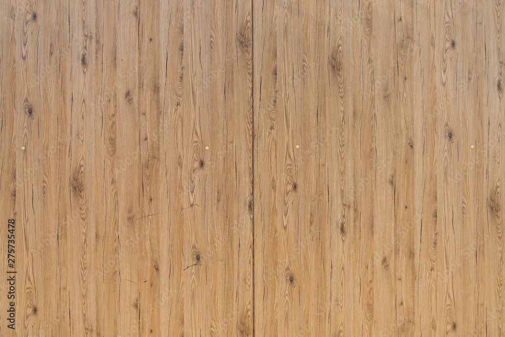

# Github_Test 1
## Github 2
### Github 3
This is a list
- one item
  - a
  - b
    - aa
    - bb    
- two item
- three item

1. one
2. two
3. three

task list
- [x] #739
- [ ] https://github.com/octo-org/octo-repo/issues/740
- [ ] task 3

Hollor at your boy @github/joehou45

**This is a great project for destroying all evil hackers in the world**

* *This is a great project for destroying all evil hackers in the world* *
* 

  ~~Bug 27: Upload problems for user~~

This is a great project for destroying all **evil hackers** in the world

***This is a great project for destroying all **evil hackers** in the world***

This is a great project for destroying all <sub>evil hackers</sub> in the world

This is a great project for destroying all <sup>evil hackers</sup> in the world

> Evil is Evil

Snipit of code from working project

```
void setup() {
  // put your setup code here, to run once:
}
void loop() {
  // put your main code here, to run repeatedly:
}
```
[hyperlink](https://pizza.com)

use this arduino file [arduino_template.ino](ardunio_template_2.ino)
[the bear file](bear/file_bear) 





